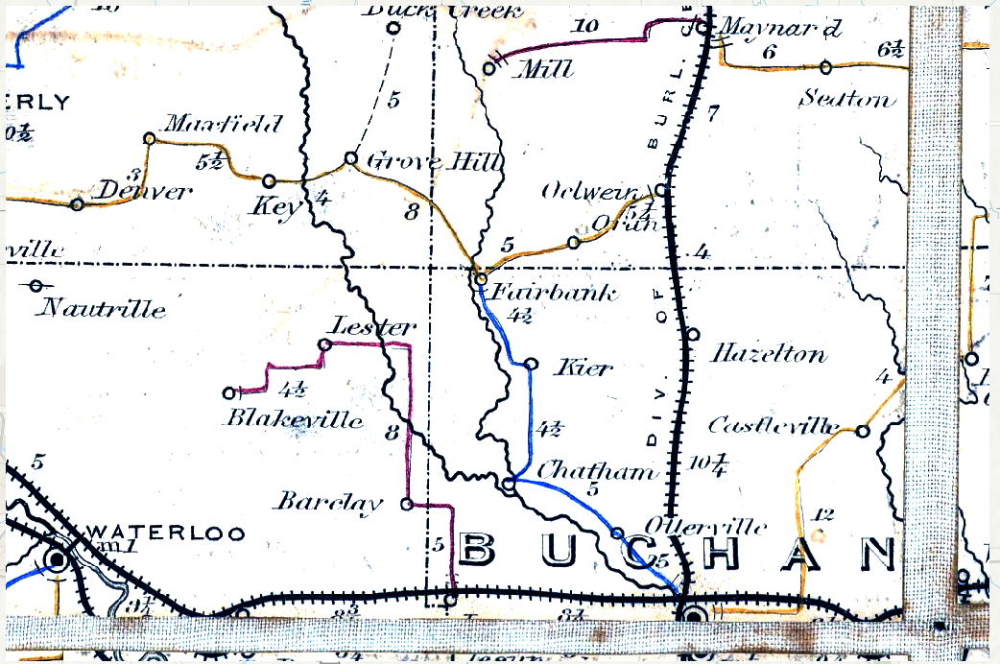

# Stretch Raster

## Libraries

```{r, eval=TRUE, message=FALSE, warning=FALSE}
library(aRcGeo)
library(arcgisbinding)
library(reticulate)
```

# ArcGIS Initialization

To run the stretch function, we will need to first initialize the connection to ArcGIS.

```{r, eval=FALSE}
aRcGeo::init_arcpy(conda_env = "arcgispro-py3-DeepLearning")
```

# Stretch Processing

```{r, eval=FALSE}
Buchanan_Stretched <- arcpy$sa$Stretch(raster = "img/png_prj/Postal_Buchanan_Route.png", 
                 stretch_type = "MinMax", 
                 min = 0.5, 
                 max = 85)
```

After running the function, we yield the following results.


